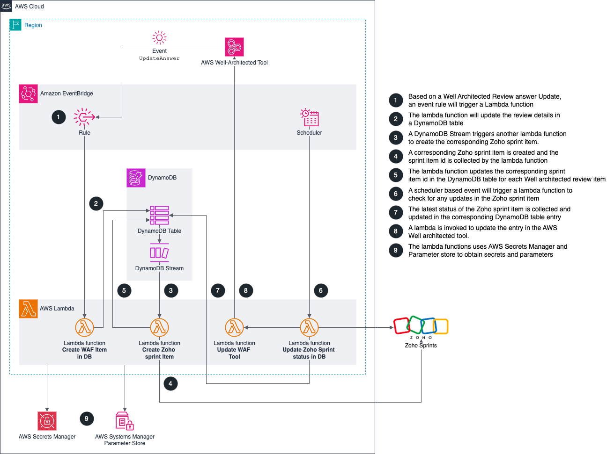

# AWS Well Architected Tool and Zoho Sprint Integration


Automate the tracking of improvement plans from AWS Well Architected review using [Zoho Sprints](https://www.zoho.com/sprints/). Zoho Sprints is a project management tool that helps enterprises plan and execute their sprints. AWS Well Architected tool is a service that helps enterprises evaluate and improve their cloud architectures. When an enterprise uses both these tools, they may need to sync the improvement plans identified by AWS Well Architected tool with the tasks in Zoho Sprints. This can be tedious and time consuming if done manually. The code in this repo can help automate this process and save time and effort.

Following are the benefits of using this code.

* The code can help enterprises track their improvement plans from AWS Well Architected tool in a more efficient and organized way using Zoho Sprints.
* The code can reduce the manual effort and human errors involved in updating the tasks in Zoho Sprints and the improvement plans in AWS Well Architected tool.
* The code can provide visibility and accountability on the progress and outcomes of the improvement plans and the tasks.

## Table of Contents

- [AWS Well Architected Tool and Zoho Sprint Integration](#aws-well-architected-tool-and-zoho-sprint-integration)
  - [Table of Contents](#table-of-contents)
  - [Architecture](#architecture)
  - [Installation](#installation)
    - [Pre-requisites](#pre-requisites)
    - [Implementation](#implementation)
  - [Usage](#usage)
  - [Attributes](#attributes)
  - [Contributing](#contributing)
  - [License](#license)
  - [Copyrights](#copyrights)

## Architecture

The architecture of the deployment is shown below.



## Installation

Following are the pre-requisites for running this code,

### Pre-requisites

1. Ensure to obtain OAuth Token for programatically calling Zoho Sprints.
2. Ensure to have necessary permissions in AWS Account to configure this code.
3. An environment where you can run Terraform code.

### Implementation

Follow the steps below to implement this code,

1. Clone this GitHub repo: [https://github.kyndryl.net/aws/zoho_waf_integration](https://github.kyndryl.net/aws/zoho_waf_integration)
2. Navigate to the `terraform` folder in the cloned directory
3. Create a `terraform.tfvars` file by copying the [sample](terraform/terraform.tfvars.sample) provided and modifying the values within the file according to your environment.
4. Execute the following commands to deploy,

```bash
terraform plan
terraform apply -auto-approve
```

## Usage

Download and watch the [Demo Video](Zoho_WAF_Integration_demo_v1.mp4) for the usage.

## Attributes

* AWS is a trademark of Amazon Web Services, Inc. Refer [https://aws.amazon.com/trademark-guidelines/](https://aws.amazon.com/trademark-guidelines/) for the AWS Trademark guidelines
* All the AWS Icons used in the architecture diagram are as per the AWS Architecture icons standard - [https://aws.amazon.com/architecture/icons/](https://aws.amazon.com/architecture/icons/)
* Zoho Sprints described in the code is a product of Zoho Corporation Pvt. Ltd. Refer the Terms of Service - [https://www.zoho.com/terms.html](https://www.zoho.com/terms.html)
* Zoho logo used in the architecture diagram is as per the Zoho Branding guidelines - [https://www.zoho.com/branding/](https://www.zoho.com/branding/)

## Contributing

All contributions (including pull requests) must agree to the Developer Certificate of Origin (DCO) [version 1.1](CONTRIBUTING.md)

Guidelines on how to contribute to the project is described [here](CONTRIBUTING.md#how-to-contribute)

## License

This project is licensed under the [MIT License](LICENSE)

## Copyrights

© Copyright Kyndryl, Inc. 2024  
Copyright contributors to the Zoho WAF Integration project.  
This project is licensed under the [MIT License](LICENSE)
Maintainers: Sujith R Pillai <s.r.pillai@kyndryl.com>, Jigar Kapasi <jigar.kapasi@kyndryl.com>
